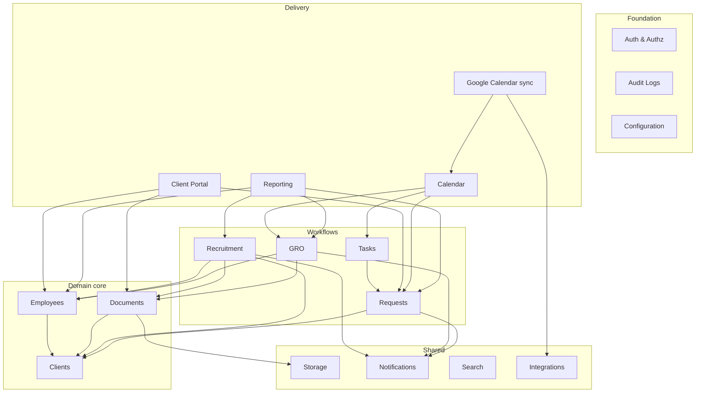

# HR Operations Platform — Architecture

## Version
**v1.4 — FROZEN as Version 1 (2026-07-18).**
This document is the build contract. Changes now require either a new ADR (for decisions) or an explicit unfreeze with a version bump — implementation drift is not a change mechanism. Implementation work is tracked in `BACKLOG.md`.

### Changelog
- **v1.4** — Added permission naming convention (`resource.action`); widened Google Calendar whitelist (names, titles, attachments allowed; government identifiers and compensation data remain prohibited); Configuration settings split into explicit system / per-client / per-user levels with precedence; walking-skeleton DoD items in `ACTION-PLAN.md` now require linked evidence. ADR-002, ADR-005, ADR-009 revised accordingly.
- **v1.3** — Created `adr/` folder with numbered Architecture Decision Records (ADR-001…009) and an index/template in `adr/README.md`. Decisions of record now live there; this document holds the stable principles and links to them.
- **v1.2** — Added role-permission matrix; Google Calendar redesigned around data minimization (interview/invitation scheduling only, explicit field whitelist); localization made configurable with Saudi defaults; added module dependency graph; walking-skeleton definitions of done added to `ACTION-PLAN.md`; RLS+Prisma spike formalized in `SPIKE-001-rls-prisma-pooling.md`.
- **v1.1** — Incorporated architecture review decisions: single-consultancy deployment model with strict per-client isolation; deny-by-default authorization; no employee self-service in scope; Saudi government platforms as reference systems (schema compatibility only, no connectors in v1); Google Calendar confirmed for v1 with PII guardrails; localization promoted to core requirement; roadmap resequenced by module dependencies; AI & Automation removed from scope; capability-ownership rule refined.
- **v1.0** — Initial vision document.

## Vision
A modern HR Operations platform for a Saudi Arabia HR consultancy, covering Recruitment, GRO, HR Operations, Employee Management, Client Portal, Documents, Requests, Tasks, Calendar, and Reporting — with future GCC expansion.

## Non-Negotiable Principles
- Modular Monolith architecture.
- One application, one deployment, one PostgreSQL database.
- Modules communicate only through public interfaces (services and domain events) — no cross-module database access.
- Strict data isolation per client company, enforced in the database, not just the application.
- Deny-by-default authorization on every endpoint and query.
- Arabic/English localization is a core architectural requirement, not a UI feature.
- All production customer data, backups, and logs remain hosted in Saudi Arabia (KSA).
- Architecture before code; every irreversible decision gets an ADR.

## Operating Model & Data Isolation

**One consultancy operates the system. Many client companies are managed within it.**

There is no multi-consultancy tenancy in scope. The enforced isolation boundary is the **client company**:

- Every client-owned record carries a mandatory `client_id` (including child tables — denormalized, never derived through joins).
- **Consultancy staff** access records across clients according to their role and permissions.
- **Client company representatives** (Client Admin / Client User) are hard-isolated to their own client company's records. No cross-client visibility, ever.
- Enforcement is layered: application-level scoping in every query **plus PostgreSQL Row-Level Security as a fail-closed backstop** for client-representative sessions. A missed `where` clause must fail closed, not leak.
- Automated cross-client isolation tests run in CI: every client-facing endpoint is probed with a wrong-client principal; any leak is a build failure.

*Future note:* if the product later becomes multi-consultancy SaaS, a top-level organization scope would wrap this model. We do not build it now; we simply avoid schema decisions that would make it impossible (no global uniqueness constraints on business identifiers that should be per-organization).

## Users & Authorization

**In scope:** consultancy staff and authorized client company representatives only.
**Out of scope (v1 and current roadmap):** employee self-service. Employees are managed records, not users. The identity model keeps a future employee-actor possible but nothing is built for it.

### Roles
| Role | Population | Scope |
|---|---|---|
| System Admin | Consultancy | Full system, user & config management |
| Company Admin | Consultancy | All operational modules, all clients |
| Recruiter | Consultancy | Recruitment, candidates, assigned clients |
| HR Officer | Consultancy | Employees, documents, requests |
| GRO Officer | Consultancy | GRO workflows, government-document data |
| Finance | Consultancy | Financial data, future billing |
| Read Only | Consultancy | Read-only across permitted modules |
| Client Admin | Client company | Own client's records; manages own client users |
| Client User | Client company | Own client's records, reduced permissions |

### Authorization model
- **Permission-based RBAC**: roles map to named permissions (`employee.read`, `document.upload`, …); code checks permissions, never role names.
- **Deny by default**: an endpoint or query without an explicit permission check is inaccessible. Guards enforce this centrally (NestJS global guard + per-route permission metadata).
- One central policy service (`can(actor, action, resource)`); no inline role conditionals scattered in handlers.
- Field-level sensitivity is part of the model: e.g., client users may see iqama expiry but not salary; salary visibility is a distinct permission.
- One identity system for both staff and client representatives (single user store, principal type + client binding on the user record); separate login surfaces if UX requires.
- MFA available from day one; required for System Admin and Company Admin.

### Permission naming convention

Every permission follows one pattern: **`resource.action`** — lowercase, dot-separated.

- **Resources are flat, singular nouns.** A sensitive field group is promoted to its own resource so its access is independently grantable: `salary.read`, not `employee.salary.read`.
- **Actions come from a fixed verb set:** `create`, `read`, `update`, `delete`, plus a small domain set (`approve`, `process`, `upload`, `export`). Adding a new verb requires review — verb sprawl is how catalogs become unreadable.
- **Client scoping is never encoded in the name.** There is no `.own` suffix: `employee.read` held by a client representative is automatically scoped to their client by the isolation layer (ADR-001) composing with the policy service (ADR-002).
- Matrix rows map to resources as follows:

| Matrix row | Resource prefix | Examples |
|---|---|---|
| System config & staff users | `config`, `staff-user` | `config.update`, `staff-user.create` |
| Client companies | `client` | `client.read`, `client.create` |
| Client portal users | `client-user` | `client-user.create` |
| Employees — core profile | `employee` | `employee.read`, `employee.update` |
| Employees — salary & financial | `salary` | `salary.read`, `salary.update` |
| Employees — government data | `govdata` | `govdata.read`, `govdata.update` |
| Documents | `document` | `document.upload`, `document.delete` |
| Recruitment | `vacancy`, `candidate` | `candidate.create`, `vacancy.approve` |
| GRO workflows | `gro` | `gro.process`, `gro.read` |
| Requests | `request` | `request.create`, `request.process` |
| Tasks | `task` | `task.update` |
| Calendar | `calendar` | `calendar.create` |
| Reports | `report` | `report.read`, `report.export` |
| Audit logs | `audit` | `audit.read` |
| Notification preferences | `notification-pref` | `notification-pref.update` |

### Permission matrix (seed)

Legend: **C**reate · **R**ead · **U**pdate · **D**elete/archive · **–** no access.
Client Admin and Client User are always scoped to **their own client company only**. This matrix is the seed for the permission catalog; the catalog in code is authoritative, and anything not granted here is denied by default.

| Capability / data | System Admin | Company Admin | Recruiter | HR Officer | GRO Officer | Finance | Read Only | Client Admin | Client User |
|---|---|---|---|---|---|---|---|---|---|
| System config & staff users | CRUD | R | – | – | – | – | – | – | – |
| Client companies | CRUD | CRUD | R | R | R | R | R | R (own) | R (own) |
| Client portal users | R | R | – | – | – | – | – | CRUD (own) | – |
| Employees — core profile | R | CRUD | R | CRUD | RU | R | R | R (own) | R (own) |
| Employees — salary & financial | R | R | – | RU | – | RU | – | – | – |
| Employees — government data (iqama, visas, GOSI) | R | R | – | R | CRUD | – | R | R (own, expiry/status only) | R (own, expiry/status only) |
| Documents | R | CRUD | CRUD (recruitment docs) | CRUD | CRUD (gov docs) | R | R | CR (own) | R (own) |
| Recruitment (vacancies, candidates, pipeline) | R | RU | CRUD | R | – | – | R | R (own vacancies) | R (own vacancies) |
| GRO workflows | R | RU | – | R | CRUD | – | R | R (own, status only) | R (own, status only) |
| Requests | R | CRUD | R | RU (process) | RU (process) | R | R | CRU (own) | CR (own) |
| Tasks (internal) | R | CRUD | CRU (own/assigned) | CRU (own/assigned) | CRU (own/assigned) | CRU (own/assigned) | R | – | – |
| Calendar | R | CRUD | CRU (own) | CRU (own) | CRU (own) | CRU (own) | R | – | – |
| Reports | R | R | R (recruitment) | R (HR ops) | R (GRO) | R (financial) | R | R (own summary) | – |
| Audit logs | R | R | – | – | – | – | – | – | – |
| Notification preferences | CRUD (all) | CRUD (all) | U (own) | U (own) | U (own) | U (own) | U (own) | U (own) | U (own) |

## Tech Stack
### Frontend
- Next.js, React, TypeScript
- Tailwind CSS (logical properties only — RTL-safe from day one), shadcn/ui
- React Hook Form, Zod, TanStack Query

### Backend
- NestJS, TypeScript

### Data
- PostgreSQL (single database; RLS enabled for client-scoped access)
- Prisma ORM (with per-module access conventions — see Module Rules)
- Redis (sessions, cache, BullMQ job queues — never a source of truth)

### Infrastructure
- Docker, GitHub, GitHub Actions
- S3-compatible object storage (KSA-hosted)
- Saudi-hosted cloud provider (selection is an open ADR — prefer managed PostgreSQL/Redis/storage)

## Localization (Core Requirement)

Localization is **configuration, not code**. All locale behavior is driven by settings owned by the Configuration module — **defaulting to Saudi conventions** but changeable without code changes, so future GCC deployments (different working weeks, calendar preferences, timezones) are a configuration exercise.

| Setting | Saudi default | Configurable range | Configured at |
|---|---|---|---|
| UI languages | Arabic + English | Any language pair; strings fully externalized | **System** defines the available set; **per-user** language choice |
| Text direction | RTL (Arabic) / LTR (English) | Follows active language | Derived — not directly configurable |
| Calendar display | Hijri (Umm al-Qura) where domain requires, Gregorian elsewhere | Per-context: Hijri, Gregorian, or dual display | **System** default; **per-client** override |
| Working week | Sunday–Thursday | Any weekday set (affects Calendar, SLAs, due dates, reports) | **System** default; **per-client** override |
| Timezone | Asia/Riyadh | Any IANA timezone | **System** default; **per-client** override |
| Number/date formatting | Locale-aware (Arabic locale in Arabic UI) | Per-locale | Derived from active locale |

**Setting levels are explicit — every setting declares its level; there are exactly three:**

1. **System** — deployment-wide defaults, managed by System Admin. The only level that exists for every setting.
2. **Per-client** — overrides on the client company record for the settings marked above, set by consultancy staff (Company Admin), never by the client themselves.
3. **Per-user** — personal preferences only (UI language, notification preferences).

Resolution precedence where an override is permitted: **user → client → system** (most specific wins). A setting with no declared per-client or per-user level cannot be overridden — attempting to is a Configuration API error, not a silent fallback. Modules read all settings through the Configuration service; hardcoding a convention is a review-blocking defect.

Invariants (not configurable):
- **Storage is always Gregorian (UTC).** Hijri is a rendering/input concern only; dual-calendar conversion lives in one shared utility in Configuration — never per-module improvisation.
- **RTL-safety is structural:** Tailwind logical utilities (`ps-*`, `pe-*`, `start-*`, `end-*`) are mandatory; physical left/right utilities are lint-blocked. shadcn/ui components verified for RTL before adoption.
- **Bilingual data fields:** person names, job titles, and company names are stored as Arabic/English pairs, matching official Saudi documents.

## Business Modules
1. Authentication & Authorization
2. Clients
3. Employees
4. Documents
5. Recruitment
6. GRO
7. Requests
8. Tasks
9. Calendar
10. Client Portal (delivery surface over existing modules — client-scoped views, no business logic of its own)
11. Reporting
12. Billing (future)

## Shared Modules
- Notifications (in-app + email in v1; SMS/WhatsApp via KSA-local provider later)
- Audit Logs (append-only; no UPDATE/DELETE grants on audit tables; every mutation logged with actor, client scope, before/after)
- Search (PostgreSQL full-text + `pg_trgm`; Arabic normalization at index time; no external search engine unless Postgres provably fails)
- Storage (presigned uploads, virus scanning, per-client key prefixes, signed URLs)
- Integrations (adapter layer — see Integrations)
- Configuration (settings at three explicit levels — system, per-client, per-user — with user → client → system precedence; localization utilities; feature flags)

## Module Rules
- Own your data: each table belongs to exactly one module (module-prefixed table names).
- **Every capability has exactly one owning module.** Other modules call its public service or react to its events. Minimal duplication is permitted when it genuinely reduces coupling — duplicated *code* is acceptable at the margins; duplicated *ownership* of a business rule is never acceptable.
- Expose services and domain events, not tables. Each module publishes a single `public-api.ts`; imports that bypass it are lint-blocked in CI.
- Cross-module side effects go through in-process domain events (e.g., `CandidateHired` → Employees creates the record, Notifications fires, Audit logs) rather than direct multi-module orchestration.

## Integrations

### v1 (built)
**Google Calendar** — purpose-limited to **interview scheduling and meeting invitations**, designed around data minimization: the adapter sends only what is necessary for an invitation to function, and nothing else.

- **Field whitelist (the only data that may leave the system):**
  - Event start/end time and timezone
  - Event title and description — participant names, job titles, and meeting titles are permitted (e.g., `Interview — Ahmed Al-Qahtani — Senior Accountant`), alongside the internal reference code for traceability
  - Location or video-meeting link
  - Attendee email addresses — consultancy staff, and the candidate's email when the invitation itself requires it
  - Attachments needed for the meeting itself (e.g., a CV for the interview panel)
- **Prohibited in any payload:** government identifiers (iqama, passport, national ID, border numbers), salary/compensation/offer terms — whether in text fields or inside attachments. The interview record in the platform remains the source of truth; the event links back by reference code.
- **Enforcement:** the whitelist is implemented in the Integrations adapter as the *only* code path to Google. Modules cannot construct payloads themselves; the adapter builds them from typed inputs, so minimization is structural, not a convention callers must remember.
- **Direction:** outbound event creation/update/cancellation only in v1; no inbound sync of external calendar content into the system.

### Reference systems (design for compatibility, do NOT build connectors)
The data model must mirror these platforms' concepts so future integration is a connector task, not a schema migration:

| Platform | Domain concepts the schema must carry |
|---|---|
| **Qiwa** | Labor contract types, work permits, Saudization/Nitaqat status |
| **GOSI** | Registration status, GOSI wage (distinct from actual salary), contribution basis |
| **Muqeem** | Iqama number/expiry, border number, exit-reentry visa data |
| **Mudad / WPS** | Wage Protection payroll compliance fields |
| **Absher Business** | Government service reference identifiers |
| **ZATCA (Fatoora)** | E-invoicing-compliant invoice fields (activates with Billing) |

All integrations — current and future — pass a KSA data-residency and PDPL review before adoption.

## Compliance & Security Baseline
- PDPL is the regulatory envelope; data residency is one clause of it. Consent basis, data-subject rights, breach procedure, and retention/erasure policy (with legal-hold semantics for records tied to government obligations) are tracked as compliance workstream items.
- Encryption in transit and at rest; field-level protection for high-sensitivity data (passport numbers, salaries).
- Structured JSON logging with request ID and client scope on every line; logs stay in KSA.
- Backups in KSA with scheduled restore testing; RPO/RTO defined in the infrastructure ADR.

## Module Dependency Graph

Arrows read "depends on". Auth/Authz, Audit Logs, and Configuration are foundation — every module depends on them, so those edges are omitted for readability.

**Reading the graph for planning:**
- **Critical path:** Clients → Employees → Documents. Nothing in Workflows can start before these land.
- **Parallelizable:** once Domain core + Notifications exist, Recruitment, GRO, and Requests/Tasks have no dependencies on each other and can be built in parallel by separate streams.
- **Delivery layer is last by construction:** Client Portal, Calendar, and Reporting only read from modules below them and hold no business logic of their own.

## Development Roadmap (dependency-ordered)

| Phase | Deliverable | Why here |
|---|---|---|
| 0 | **Walking skeleton**: monorepo, module skeleton + boundary lint rules, CI/CD, deploy to KSA host, RLS + Prisma isolation spike, i18n/RTL scaffold | Every later phase inherits these; retrofits are the expensive failure mode |
| 1 | **Authentication & Authorization** + **Audit Logs** + Configuration | Everything depends on identity, permissions, and auditability; audit must exist before the first business mutation |
| 2 | **Clients** | The isolation anchor — `client_id` originates here; nothing client-scoped can precede it |
| 3 | **Employees** | The gravitational center of the domain; Recruitment terminates in it and GRO operates on it. Built with KSA-reference-system fields, bilingual names, Hijri-rendered dates |
| 4 | **Documents + Storage** and **Notifications** | Required by Recruitment (CVs, offers) and GRO (iqama/passport scans); document **expiry tracking + alerts** is a headline GRO feature and needs Notifications |
| 5 | **Recruitment** | Consumes Clients, Documents, Notifications; `CandidateHired` event creates Employees |
| 6 | **GRO** | Consumes Employees, Documents, Notifications; heaviest user of reference-system fields and Hijri rendering |
| 7 | **Requests + Tasks** | *Request* = client-facing workflow object (owned by Requests); *Task* = internal work item (owned by Tasks); a Request may spawn Tasks via events. Needed before the portal has anything interactive to offer |
| 8 | **Client Portal** | Thin, client-scoped delivery surface over Employees, Documents, Requests; ships once there is real data and workflows to expose; first hard test of RLS + client-representative auth in production |
| 9 | **Calendar + Google Calendar integration** | Depends on Tasks/Requests/GRO deadlines being real; integration guardrails per Integrations section |
| 10 | **Reporting** | Reads everything; v1 = transactional queries + materialized views on the primary — no warehouse, no ETL |
| — | **Future**: Billing (ZATCA-ready), government connectors, SMS/WhatsApp notifications, AI & automation | Explicitly out of current scope |

## AI Master Prompt

You are a Principal Software Architect helping build an enterprise HR Operations platform for a Saudi HR consultancy.

Rules:
- Modular Monolith only. Next.js + NestJS + PostgreSQL + Prisma.
- One consultancy, many client companies: every client-owned table carries `client_id`; client representatives are hard-isolated to their own client.
- Deny-by-default authorization: no endpoint or query ships without an explicit permission check.
- Never generate code outside the current module; modules interact only via `public-api.ts` services and domain events. No cross-module DB access.
- Every capability has exactly one owning module; prefer minimal duplication over cross-module coupling.
- Localization is core: externalized strings, RTL-safe logical CSS properties only, Gregorian storage with Hijri rendering, bilingual name fields.
- Model Saudi reference systems (Qiwa, GOSI, Muqeem, Mudad, ZATCA) in schemas; do not build connectors.
- Keep all production data, backups, and logs hosted in Saudi Arabia. No PII in payloads to non-KSA services (including Google Calendar).
- Explain architecture before code. Follow SOLID. Consult the ADRs in `adr/` before proposing designs.
